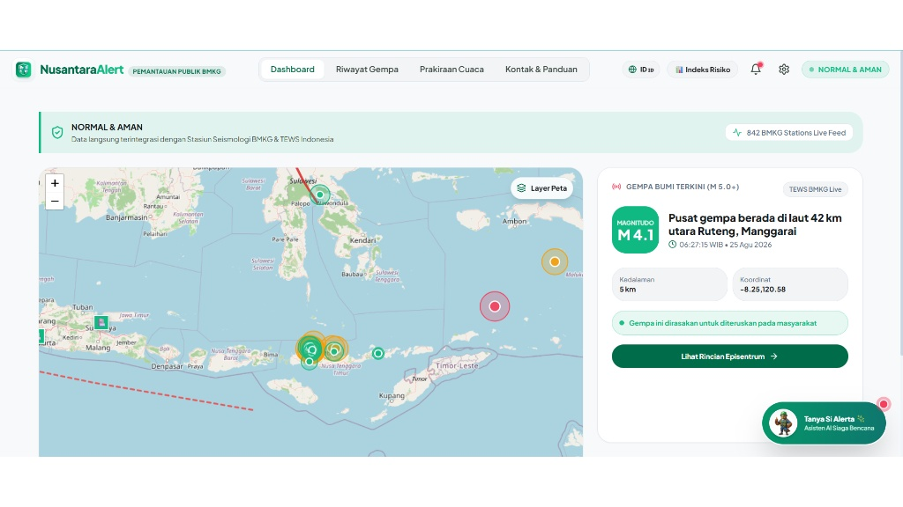

# 🌋 NusantaraAlert - Portal Pemantauan Bencana & Meteorologi Publik Indonesia

[](https://nusantara-alert-nine.vercel.app/)
[](./LICENSE)
[](https://react.dev/)
[](https://vitejs.dev/)
[](https://tailwindcss.com/)
[](https://nusantara-alert-nine.vercel.app/)

<p align="center">
  
</p>

> **NusantaraAlert** adalah platform publik terpadu pemantauan siaga bencana geofisika dan cuaca waktu-nyata di Indonesia. Terintegrasi langsung dengan API resmi **BMKG (TEWS)** dan **Open Data Meteorologi**, platform ini menyajikan peta episentrum interaktif, analisis jalur sesar aktif, prediksi cuaca presisi kota/kabupaten, asisten AI siaga bencana *"Si Alerta"*, serta nomor darurat panggilan langsung.

🌐 **Demo Website Live**: [https://nusantara-alert-nine.vercel.app/](https://nusantara-alert-nine.vercel.app/)


---

## 📸 Maskot Resmi: Si Alerta 🦅

<p align="center">
  
  <br />
  <b>Si Alerta</b> — <i>Asisten AI Siaga Bencana & Kesiapsiagaan Publik</i>
</p>

---

## ✨ Fitur-Fitur Utama

### 📡 1. Integrasi Live API BMKG (TEWS) & Geofisika
- **Autogempa Real-Time**: Laporan gempa bumi M 5.0+ terbaru dari stasiun BMKG beserta skala intensitas MMI, kedalaman, koordinat, dan status evaluasi potensi tsunami.
- **Peta Episentrum Interaktif**: Visualisasi lingkaran magnitudo dan getaran episentrum berbasis Leaflet.js.

### 🗺️ 2. Layers Peta Tematik Interaktif
- ⚡ **Overlay Jalur Sesar Aktif**: Garis patahan geologi utama di Indonesia (*Sesar Lembang, Sesar Opak, Megathrust Sunda Jawa-Sumatera, Sesar Palu-Koro, Sesar Semangko, Sesar Sorong*).
- 🏥 **Posko Evakuasi & Rumah Sakit**: Penanda lokasi fasilitas kesehatan gawat darurat dan Posko SAR terdekat.
- 🌧️ **Citra Radar Hujan Live**: Layer peta tematik pergerakan awan dan presipitasi hujan.

### 🦅 3. Asisten AI Siaga Bencana ("Si Alerta AI")
- **Tanya Jawab Real-Time**: Menjawab pertanyaan warga seputar lokasi gempa terbaru, tanda-tanda awal tsunami, nomor darurat, dan daftar kelengkapan Tas Siaga Bencana (TSB).
- **Pencarian Cuaca Geocoding**: Dapat mencari cuaca kota/kabupaten spesifik di seluruh Indonesia secara instan (contoh: *"info cuaca Lhokseumawe"*).

### 📱 4. PWA (Progressive Web App) & Offline Mode
- Dapat **diinstal langsung di homescreen HP** (Android/iOS) tanpa melalui App Store / Play Store.
- **Service Worker (`sw.js`)**: Caching aset offline dan dokumen panduan darurat sehingga tetap bisa dibuka saat jaringan internet terputus di area bencana.

### 📊 5. Indeks Risiko Bencana Per Kabupaten/Kota
- Mesin pencari data kerawanan geofisika untuk **500+ Kota & Kabupaten** se-Indonesia.
- Indikator skor & tingkat risiko (Rendah, Sedang, Tinggi) untuk **Gempa Bumi**, **Tsunami**, **Banjir**, **Tanah Longsor**, dan **Gunung Berapi**.

### 📞 6. Panggilan Darurat Direct 24 Jam (Click to Dial)
Panggilan telepon langsung bebas pulsa untuk respon darurat cepat:
- 🚑 **115**: Basarnas (SAR & Evakuasi)
- 🏢 **117**: Call Center BNPB Pusat
- 🚑 **119**: Ambulans Medis Darurat (NCC)
- 🚓 **110**: Kepolisian RI
- 🚒 **113**: Pemadam Kebakaran
- 🌋 **196**: Informasi BMKG Pusat

### 🌤️ 7. Prakiraan Cuaca Lengkap & Animasi Vector 3D
- Visualisasi cuaca interaktif SVG/CSS (*Cerah, Cerah Berawan, Berawan, Hujan, Hujan Petir, Malam Cerah*).
- Informasi parameter atmosfer: Suhu (°C), Kelembapan Udara, Kecepatan Angin, Indeks Radiasi UV, dan Kualitas Udara.

---

## 🛠️ Teknologi yang Digunakan

- **Frontend Core**: React.js 18 & Vite 5
- **Styling & Design System**: Tailwind CSS 3 & Vanilla CSS Animation Keyframes
- **Map & Spatial**: Leaflet.js & React-Leaflet
- **Icons**: Lucide React Icons
- **APIs & Data Feeds**:
  - BMKG TEWS (`autogempa.json`, `gempaterkini.json`, `gempadirasakan.json`)
  - Open-Meteo Weather & Geocoding API
  - OpenStreetMap & OpenWeather Radar Tiles

---

## 🚀 Panduan Instalasi & Pengembangan Lokal

### Persyaratan Sistem
- Node.js versi 18.0 atau yang lebih baru
- npm / pnpm / yarn

### Langkah-Langkah

1. **Clone Repository**:
   ```bash
   git clone https://github.com/Khairul122/NusantaraAlert.git
   cd NusantaraAlert
   ```

2. **Instal Dependensi**:
   ```bash
   npm install
   ```

3. **Jalankan Server Pengembang (Dev Server)**:
   ```bash
   npm run dev
   ```
   Akses aplikasi di browser pada `http://localhost:3000/`.

4. **Kompilasi Produksi (Build Output)**:
   ```bash
   npm run build
   ```
   Hasil build siap deploy akan tersimpan pada direktori `dist/`.

---

## 📂 Struktur Direktori Proyek

```text
NusantaraAlert/
├── public/
│   ├── logo.png             # Logo Emblem Resmi NusantaraAlert
│   ├── mascot.png           # Maskot 3D Si Alerta (Elang Jawa)
│   ├── manifest.json        # Web App Manifest PWA
│   └── sw.js                # Service Worker Offline Access
├── src/
│   ├── components/
│   │   ├── AlertAiChatbot.jsx        # Chatbot AI & Dynamic Geocoding Weather
│   │   ├── AnimatedWeatherVisual.jsx# Animasi Vector Cuaca 3D
│   │   ├── DetailGempaModal.jsx     # Modal Detail Episentrum Gempa
│   │   ├── DisasterAlertModal.jsx   # Pop-Up Siaga Bencana Publik
│   │   ├── DisasterRiskModal.jsx    # Indeks Risiko Bencana Per Kab/Kota
│   │   ├── Header.jsx               # Navigation Bar & PWA Trigger
│   │   ├── InteractiveMap.jsx       # Peta Leaflet & Layer Tematik Sesar Aktif
│   │   ├── MobileNav.jsx            # Bottom Navigation Bar Mobile
│   │   ├── NotificationDrawer.jsx   # Drawer Notifikasi Peringatan Dini
│   │   └── SettingsModal.jsx        # Modal Pengaturan Frekuensi Data
│   ├── pages/
│   │   ├── DashboardPage.jsx        # Beranda Utama & Peta Live
│   │   ├── KontakPanduanPage.jsx    # Direct Call & Panduan Mitigasi
│   │   ├── PrakiraanCuacaPage.jsx   # Pencarian Cuaca Kota/Kabupaten
│   │   └── RiwayatGempaPage.jsx     # Arsip Seismograf BMKG
│   ├── services/
│   │   └── bmkgService.js           # Fetcher API BMKG TEWS & Open-Meteo
│   ├── App.jsx                      # Main React Component
│   ├── index.css                    # Design Tokens & Keyframe Animations
│   └── main.jsx                     # Application Entry Point
├── index.html                       # HTML Entry Point & SEO Metadata
├── tailwind.config.js               # Konfigurasi Tema Tailwind CSS
├── vite.config.js                   # Konfigurasi Vite Bundler
├── LICENSE                          # Lisensi MIT (Synectra Jasa Digital)
└── README.md                        # Dokumentasi Proyek
```

---

## 📜 Lisensi & Hak Cipta

Proyek ini dilindungi di bawah lisensi **MIT License**.

Hak Cipta (c) 2026 **Synectra Jasa Digital**. Seluruh hak cipta dilindungi.

---

<p align="center">
  Dibuat dengan 💚 untuk Kesiapsiagaan & Keselamatan Masyarakat Indonesia oleh <b>Synectra Jasa Digital</b>.
</p>
